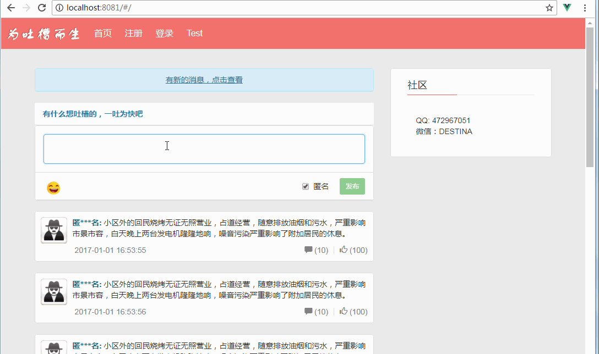

# vue-demo-tucao-weiblog  
这是一个使用Vue实现的简易微博系统。前后台分离，纯前台可独立运行和调试。
微博系统的后端使用Spring Boot实现，[移步到后端系统](https://github.com/weieyuan/spring-boot-tucao-weibo).

#### Demo
纯前台运行的效果：  


#### 项目结构
* src/component:Vue组件代码
* src/config: 配置信息
* src/css：存放样式文件和样式中需要用到的公共的变量(使用less编写样式)
* src/mock: 前台的桩数据，确保前台可独立运行
* src/router: 路由
* src/store: 共享数据(vuex)
* src/widget: 存放工具类和自定义组件和控件  

#### 功能点
1.新消息提醒和查看  
2.发布微博，和微博展示
3.微博的点赞，查看微博的评论  
4.添加微博评论功能  
5.评论点赞，查看评论的回复  
6.添加评论回复功能  
7.回复点赞功能 

#### 技术栈
Vue  
Vue-router  
Vuex  
Bootstrap  
ES6  
Stomp(WebSocket)

#### 关键点

1.通过全局的mixin向所有的组件中注入debug的标志位，用于标识是否使用打桩数据。

```
Vue.mixin({
  data() {
    return {
      debug: globalConfig.debug
    }
  }
});
```

#### Build Setup

``` bash
# install dependencies
npm install

# serve with hot reload at localhost:8081
npm run dev

# build for production with minification
npm run build

# build for production and view the bundle analyzer report
npm run build --report
```

#### 说明
本项目的起因是XXX人说最近很郁闷，希望有一个可以专门吐槽的网站。正好最近在学习vue，因此萌生了用vue开发一个可以吐槽的微博网站，借此项目巩固vue的知识点。本项目非商用项目，仅供学习使用。

界面的样式设计参考了如下网站：  
[www.golaravel.com]()  
[https://weibo.com]()  
[http://t.qq.com]()